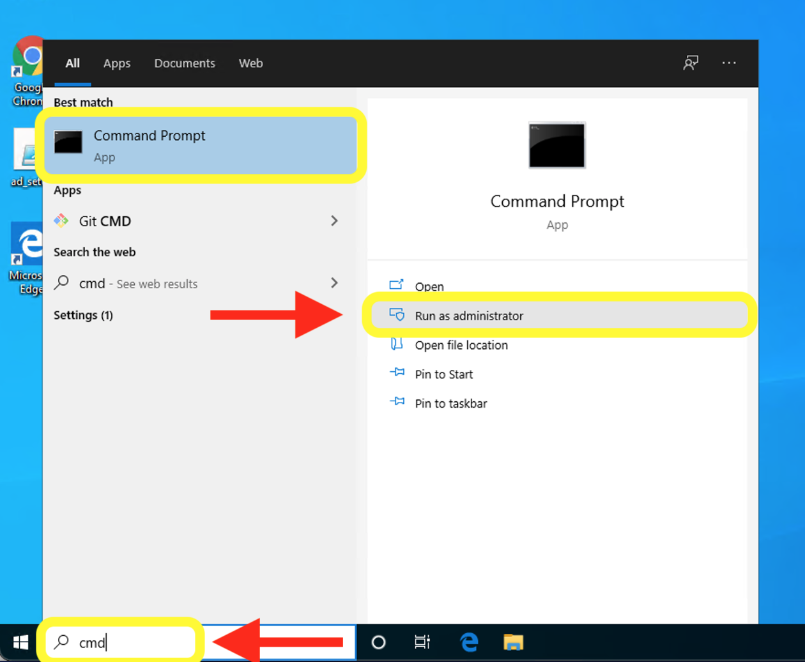
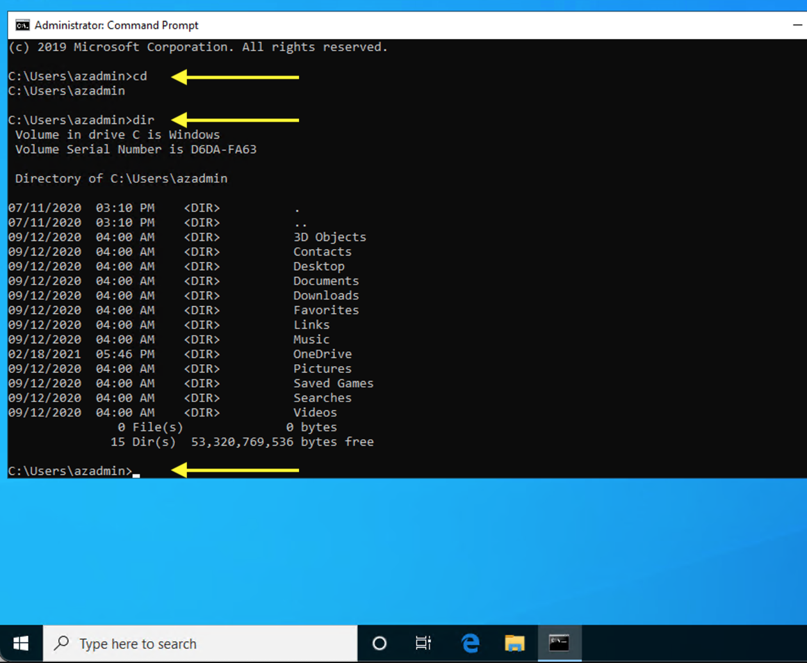

# Windows

**UNDER CONSTRUCTION**

## CMD Windows Command Prompt

Windows Command Prompt is not the same thing as Git Bash and does not replace Git Bash.

CMD                   |Bash
----------------------|---------------
`cd`                  |`pwd`
`chdir` or `cd`       |`cd`
`cls`                 |`clear`
`cmd <command>`       |`man <command>`
`copy`                |`cp`
`del` or `erase`      |`rm` or `rm -r`
`dir`                 |`ls`
`echo`                |`echo`
`exit`                |`exit`
`find`                |`grep`
`help <command>`      |`man <command>`
`mkdir` or `md`       |`mkdir`
`move`                |`mv`
`rmdir` or `rd`       |`rmdir`
`rmdir /S` or `rd /S` |`rm -r`
`tree`                |
`type`                |`cat`
