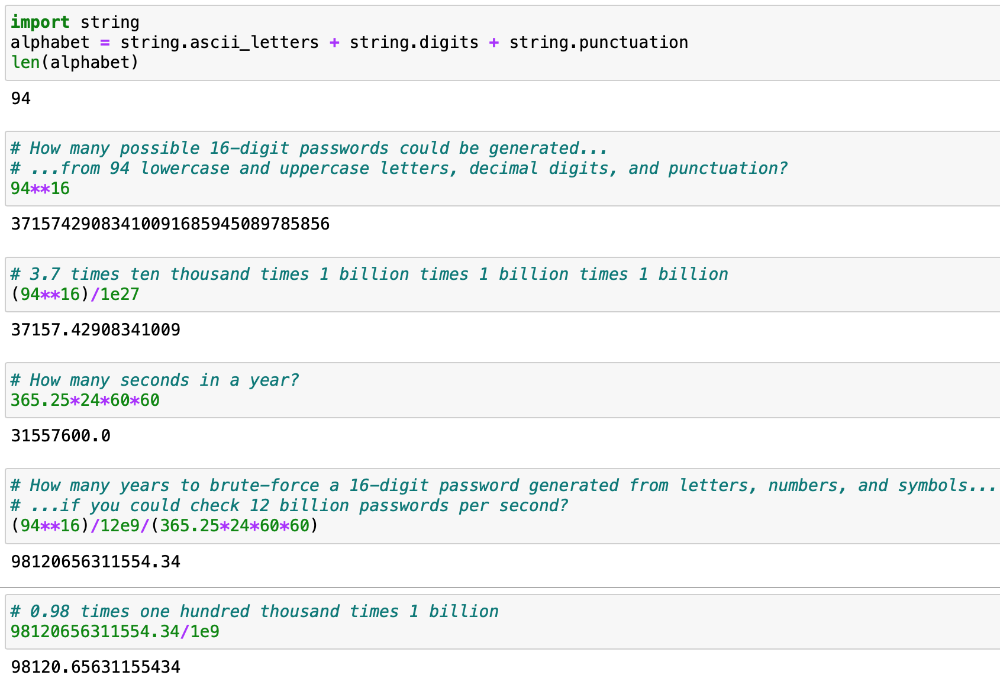

# Cryptography

How is cryptography related to or different from encryption? Encryption plays a role in cryptography, but in addition to message confidentiality, modern cryptographic schemes also attempt to, for example, preserve message integrity. In other words, cryptography includes encryption, but encryption doesn’t include cryptography.

Separation of concerns in a modern security scheme:
* Message Secrecy/Confidentiality (e.g., encryption)
* Message Authentication/Integrity (e.g., cryptographic hash function, digital signature)

-----

Private-Key Setting
* Message Confidentiality: Symmetric/Private-Key Encryption
* Message Integrity: Cryptographic Hash Function
Public-Key Setting
* Message Confidentiality: Asymmetric/Public-Key Encryption
* Message Integrity: Digital Signature

Symmetric cryptography is “private-key” cryptography: there is no public key in this setting; and the private key is used to both encrypt plaintext and decrypt ciphertext when transmitting confidential messages back and forth. In implementing private-key cryptography in the real world, the private key must be transmitted from the sender(s) to the receiver(s) over a secure channel before confidential communication can occur. PKI Public Key Infrastructure emerged as a way to deal with the practical issues of distributing keys over insecure channels. Account PINs and passwords, on the other hand, are a form of user authentication and authorization:

-----

Say you have a 4-digit PIN to unlock an account. Each number can be one of ten decimal digits {0, 1, 2, 3, 4, 5, 6, 7, 8, 9}. So, how many possible PINs are there, according to this scheme? 10^4 = 10,000.
On its own, this is an insecure form of authentication because an attacker with a single “3 GHz quad-core processor”-equipped machine that can run (3 x 10^9) x 4 = 12 billion password attempts per second (assuming there is a one-to-one correspondence between instruction execution speed and password attempt rate) could brute-force their way through all possible PINs within the order of a tenth of a millisecond (10^-7 seconds).

A password of at least eight digits that includes lowercase and uppercase letters, numbers, and symbols is more secure.

-----

Say you have a 16-digit password to unlock an account. Each character can be one of 94 lowercase and uppercase letters, decimal digits, and punctuation. So, how many possible passwords are there, according to this scheme? 94^16 = 37157429083410091685945089785856. (This number is on the order of ten thousand billion billion billion.)

The same attacker with the same computational capabilities would require on the order of one hundred thousand billion (10^14) years to brute-force their way through all possible passwords.

-----

Things are more sophisticated in practice, but this may serve to illustrate the intuition behind the use of passwords in comparison to private-key and public-key communication.

## Resources

Katz, Jonathan & Yehuda Lindell. [_Introduction to Modern Cryptography, 3rd Ed_](https://www.cs.umd.edu/~jkatz/imc.html). 
Sweigart, Al. (2018). [_Cracking Codes with Python: An Introduction to Building and Breaking Ciphers_](http://inventwithpython.com/cracking/). No Starch Press.br<>
Wong, David. (2021). _Real-World Cryptography_. Manning. 

NaCl: Networking and Cryptography Library [Home](http://nacl.cr.yp.to) 
TweetNaCl: a crypto library in 100 tweets [Home](http://tweetnacl.cr.yp.to) 
TweetNaCl.js [Home](https://tweetnacl.js.org/#/) 

## Figures

Chaum, David [Wiki](https://en.wikipedia.org/wiki/David_Chaum) 
Dwork, Cynthia [Wiki](https://en.wikipedia.org/wiki/Cynthia_Dwork) 
Jakobsson, Markus [Wiki](https://en.wikipedia.org/wiki/Markus_Jakobsson) 
Katz, Jonathan [Home](https://www.cs.umd.edu/~jkatz/) 
Naor, Moni [Wiki](https://en.wikipedia.org/wiki/Moni_Naor) 

## Terms

Adversary [Wiki](https://en.wikipedia.org/wiki/Adversary_(cryptography)) 
Blind Signature [Wiki](https://en.wikipedia.org/wiki/Blind_signature) 
Ciphertext [Wiki](https://en.wikipedia.org/wiki/Ciphertext) 
Code [Wiki](https://en.wikipedia.org/wiki/Code_(cryptography)) 
Cryptanalysis [Wiki](https://en.wikipedia.org/wiki/Cryptanalysis) 
CHF Cryptographic Hash Function [Wiki](https://en.wikipedia.org/wiki/Cryptographic_hash_function) 
Cryptographic Primitive [Wiki](https://en.wikipedia.org/wiki/Cryptographic_primitive) 
Cryptography 
Cryptology 
Cryptosystem [Wiki](https://en.wikipedia.org/wiki/Cryptosystem) 
Digital Signature [Wiki](https://en.wikipedia.org/wiki/Digital_signature) 
Encryption [Wiki](https://en.wikipedia.org/wiki/Encryption) 
Fundamental Theorem of Arithmetic [Wiki](https://en.wikipedia.org/wiki/Fundamental_theorem_of_arithmetic) 
Mersenne Twister [Wiki](https://en.wikipedia.org/wiki/Mersenne_Twister) 
Multiple Encryption [Wiki](https://en.wikipedia.org/wiki/Multiple_encryption) 
Negligible Function [Wiki](https://en.wikipedia.org/wiki/Negligible_function) 
Permutation [Wiki](https://en.wikipedia.org/wiki/Permutation) 
Plaintext [Wiki](https://en.wikipedia.org/wiki/Plaintext) 
PGP Pretty Good Privacy [Wiki](https://en.wikipedia.org/wiki/Pretty_Good_Privacy) 
Randomized Algorithm [Wiki](https://en.wikipedia.org/wiki/Randomized_algorithm) 
Secret Sharing [Wiki](https://en.wikipedia.org/wiki/Secret_sharing) 
Secure Multiparty Computation [Wiki](https://en.wikipedia.org/wiki/Secure_multi-party_computation) 
Standard Model [Wiki](https://en.wikipedia.org/wiki/Standard_model_(cryptography)) 
Strong Cryptography [Wiki](https://en.wikipedia.org/wiki/Strong_cryptography) 
Substitution Cipher [Wiki](https://en.wikipedia.org/wiki/Substitution_cipher) 
Sybil Attack [Wiki](https://en.wikipedia.org/wiki/Sybil_attack) 
Transposition Cipher [Wiki](https://en.wikipedia.org/wiki/Transposition_cipher) 
ZKP Zero Knowledge Proof [Wiki](https://en.wikipedia.org/wiki/Zero-knowledge_proof) 
